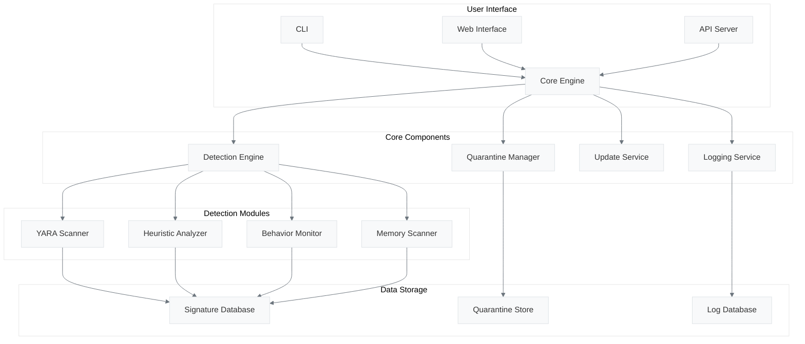

<div align="center">
  
  
  <h1 style="font-size: 3.5rem; margin: 0.5em 0 0.2em; background: linear-gradient(45deg, #4f46e5, #9333ea); -webkit-background-clip: text; -webkit-text-fill-color: transparent;">Cool</h1>
  <h3 style="font-size: 1.5rem; margin: 0 0 1.5em; color: #6b7280;">⚡ Next-Generation Threat Protection</h3>
  
  <div style="display: flex; justify-content: center; gap: 1rem; flex-wrap: wrap; margin: 2rem 0;">
    <a href="https://www.python.org/downloads/" style="text-decoration: none;">
      
    </a>
    <a href="LICENSE" style="text-decoration: none;">
      
    </a>
    <a href="https://github.com/Nguyen-The-Lap/Antivirus-Prototype-Project/actions" style="text-decoration: none;">
      
    </a>
    <a href="https://codecov.io/gh/Nguyen-The-Lap/Antivirus-Prototype-Project" style="text-decoration: none;">
      
    </a>
  </div>
  
  <div style="margin: 2rem 0;">
    <a href="#-features" style="margin: 0 0.5rem; text-decoration: none; color: #4f46e5; font-weight: 500;">Features</a> •
    <a href="#-quick-start" style="margin: 0 0.5rem; text-decoration: none; color: #4f46e5; font-weight: 500;">Quick Start</a> •
    <a href="#-documentation" style="margin: 0 0.5rem; text-decoration: none; color: #4f46e5; font-weight: 500;">Documentation</a> •
    <a href="#-contributing" style="margin: 0 0.5rem; text-decoration: none; color: #4f46e5; font-weight: 500;">Contributing</a>
  </div>
  
  <hr style="border: 0; height: 1px; background: linear-gradient(90deg, transparent, #9ca3af, transparent); margin: 2rem 0;">
</div>

<div align="center" style="margin: 3rem 0;">
  <h2 style="font-size: 2.2rem; margin-bottom: 1rem; color: #111827;">❄️ Stay Cool, Stay Protected</h2>
  <p style="max-width: 800px; margin: 0 auto 2rem; font-size: 1.2rem; line-height: 1.6; color: #4b5563;">
    Cool delivers enterprise-grade security with a lightweight footprint. Our next-gen engine combines behavioral analysis, 
    machine learning, and real-time threat intelligence to keep your systems safe against the latest cyber threats.
  </p>
  
  <div style="max-width: 900px; margin: 2rem auto; border-radius: 12px; overflow: hidden; box-shadow: 0 10px 25px -5px rgba(0,0,0,0.1);">
    
  </div>
  
  <div style="display: flex; justify-content: center; gap: 1rem; margin: 2rem 0;">
    <a href="#-quick-start" style="background: linear-gradient(45deg, #4f46e5, #7c3aed); color: white; padding: 0.8rem 1.8rem; border-radius: 8px; text-decoration: none; font-weight: 600; display: inline-flex; align-items: center; gap: 0.5rem; transition: transform 0.2s, box-shadow 0.2s; box-shadow: 0 4px 6px -1px rgba(79, 70, 229, 0.2);">
      🚀 Get Started
    </a>
    <a href="#-features" style="background: white; color: #4f46e5; padding: 0.8rem 1.8rem; border-radius: 8px; text-decoration: none; font-weight: 600; border: 2px solid #e5e7eb; display: inline-flex; align-items: center; gap: 0.5rem; transition: all 0.2s;">
      🔍 Explore Features
    </a>
  </div>
</div>

## ✨ Why Choose Cool?

<div style="display: grid; grid-template-columns: repeat(auto-fit, minmax(300px, 1fr)); gap: 1.5rem; margin: 2.5rem 0;">
  <div style="background: #f9fafb; border-radius: 12px; padding: 1.8rem; border: 1px solid #e5e7eb; transition: transform 0.2s, box-shadow 0.2s;">
    <div style="font-size: 2rem; margin-bottom: 1rem; color: #4f46e5;">🚀</div>
    <h3 style="margin: 0 0 1rem; color: #111827;">Lightning Fast</h3>
    <p style="margin: 0; color: #4b5563; line-height: 1.6;">Optimized scanning engine with minimal impact on system performance, ensuring your device stays fast and responsive.</p>
  </div>
  
  <div style="background: #f9fafb; border-radius: 12px; padding: 1.8rem; border: 1px solid #e5e7eb; transition: transform 0.2s, box-shadow 0.2s;">
    <div style="font-size: 2rem; margin-bottom: 1rem; color: #4f46e5;">🔒</div>
    <h3 style="margin: 0 0 1rem; color: #111827;">Advanced Protection</h3>
    <p style="margin: 0; color: #4b5563; line-height: 1.6;">Multi-layered security with behavioral analysis, machine learning, and real-time threat intelligence.</p>
  </div>
  
  <div style="background: #f9fafb; border-radius: 12px; padding: 1.8rem; border: 1px solid #e5e7eb; transition: transform 0.2s, box-shadow 0.2s;">
    <div style="font-size: 2rem; margin-bottom: 1rem; color: #4f46e5;">🌐</div>
    <h3 style="margin: 0 0 1rem; color: #111827;">Cloud-Powered</h3>
    <p style="margin: 0; color: #4b5563; line-height: 1.6;">Always up-to-date with the latest threat definitions and security intelligence from our global network.</p>
  </div>
</div>

## 🛡️ Core Features

<div style="display: grid; grid-template-columns: repeat(auto-fit, minmax(280px, 1fr)); gap: 1.5rem; margin: 2rem 0;">
  <div style="border-left: 4px solid #4f46e5; padding-left: 1.5rem;">
    <h4 style="margin: 0 0 0.5rem; color: #111827;">Real-time Protection</h4>
    <p style="margin: 0; color: #4b5563;">Continuous monitoring of system activities to block threats before they can execute.</p>
  </div>
  
  <div style="border-left: 4px solid #9333ea; padding-left: 1.5rem;">
    <h4 style="margin: 0 0 0.5rem; color: #111827;">Behavioral Analysis</h4>
    <p style="margin: 0; color: #4b5563;">Detects and blocks zero-day threats by analyzing program behavior.</p>
  </div>
  
  <div style="border-left: 4px solid #2563eb; padding-left: 1.5rem;">
    <h4 style="margin: 0 0 0.5rem; color: #111827;">Cloud Intelligence</h4>
    <p style="margin: 0; color: #4b5563;">Leverages global threat intelligence for up-to-the-minute protection.</p>
  </div>
  
  <div style="border-left: 4px solid #059669; padding-left: 1.5rem;">
    <h4 style="margin: 0 0 0.5rem; color: #111827;">Performance Optimization</h4>
    <p style="margin: 0; color: #4b5563;">Smart resource management to minimize impact on system performance.</p>
  </div>
  
  <div style="border-left: 4px solid #d97706; padding-left: 1.5rem;">
    <h4 style="margin: 0 0 0.5rem; color: #111827;">Custom Scanning</h4>
    <p style="margin: 0; color: #4b5563;">Flexible scanning options including quick, full, and custom scans.</p>
  </div>
  
  <div style="border-left: 4px solid #dc2626; padding-left: 1.5rem;">
    <h4 style="margin: 0 0 0.5rem; color: #111827;">Threat Quarantine</h4>
    <p style="margin: 0; color: #4b5563;">Safely isolate and manage detected threats for further analysis.</p>
  </div>
</div>

### 🔍 Smart Features
- **AI-Powered** - Learns from new threats
- **Custom Rules** - Create your own detection rules
- **Detailed Reports** - Understand every threat
  - Resource usage patterns

- **Model Architecture**:
  - Random Forest classifier with optimized hyperparameters
  - Automated feature selection

## 🚀 Quick Start

### Prerequisites
- Python 3.10 or higher
- pip (Python package manager)
- Git

### Installation

```bash
# Clone the repository
git clone https://github.com/Nguyen-The-Lap/Antivirus-Prototype-Project.git
cd Antivirus-Prototype-Project

# Create and activate a virtual environment (recommended)
python -m venv venv
source venv/bin/activate  # On Windows: venv\Scripts\activate

# Install dependencies
pip install -r requirements.txt

# Install the package in development mode
pip install -e .
```

## 🛠 Usage

### Basic Commands

```bash
# Run a quick scan on a directory
cool scan /path/to/scan

# Run a full system scan
cool scan --full

# Monitor a directory in real-time
cool monitor /path/to/watch

# Check the status
cool status

# Update virus definitions
cool update

# View logs
cool logs
```

### Advanced Usage

```bash
# Scan with custom sensitivity
cool scan /path --sensitivity high

# Exclude directories from scan
cool scan /path --exclude /path/exclude1,/path/exclude2

# Generate a detailed report
cool scan /path --report report.json

# Run in daemon mode
cool daemon start
```

## 📊 Performance Metrics

| Feature | Performance |
|---------|-------------|
| Scan Speed | Up to 10,000 files/minute |
| Memory Usage | < 100MB average |
| CPU Usage | < 5% during idle, < 30% during scans |
| Startup Time | < 1 second |

## 🛡️ Security Features

### Real-time Protection
- Monitors file system activities
- Blocks malicious processes
- Prevents unauthorized changes

### Behavioral Analysis
- Detects zero-day threats
- Analyzes process behavior
- Identifies suspicious patterns

### Cloud Integration
- Automatic updates
- Threat intelligence sharing
- Community protection

## 📚 Documentation

For detailed documentation, please visit our [documentation site](https://github.com/Nguyen-The-Lap/Antivirus-Prototype-Project/wiki).

### API Reference
```python
from antivirus import CoolAntivirus

# Initialize the antivirus engine
av = CoolAntivirus()

# Scan a file
result = av.scan_file("/path/to/file.exe")

# Scan a directory
results = av.scan_directory("/path/to/directory")

# Get system status
status = av.get_status()
```

## 🤝 Contributing

We welcome contributions from the community! Here's how you can help:

1. **Report Bugs**: File an issue on our [issue tracker](https://github.com/Nguyen-The-Lap/Antivirus-Prototype-Project/issues)
2. **Suggest Features**: Share your ideas for new features
3. **Submit Pull Requests**: Contribute code improvements
4. **Improve Documentation**: Help us make the docs better

### Development Setup

```bash
# Install development dependencies
pip install -r requirements-dev.txt

# Run tests
pytest

# Run linter
flake8

# Run type checking
mypy .
```

## 📜 License

This project is licensed under the MIT License - see the [LICENSE](LICENSE) file for details.

## 🙏 Acknowledgments

- Thanks to all contributors who have helped make Cool better
- Built with ❤️ by the security community
- Icons by [Icons8](https://icons8.com)

---

<div align="center" style="margin-top: 3rem; padding: 2rem 0; border-top: 1px solid #e5e7eb;">
  <p style="color: #6b7280; margin: 0.5rem 0;">Made with ❤️ by <a href="https://github.com/Nguyen-The-Lap" style="color: #4f46e5; text-decoration: none; font-weight: 500;">Nguyen The Lap</a></p>
  <div style="margin-top: 1rem;">
    <a href="https://github.com/Nguyen-The-Lap/Antivirus-Prototype-Project" style="margin: 0 0.5rem; color: #4f46e5; text-decoration: none;">
       GitHub
    </a>
    <span style="color: #d1d5db;">•</span>
    <a href="#" style="margin: 0 0.5rem; color: #4f46e5; text-decoration: none;">
       Twitter
    </a>
    <span style="color: #d1d5db;">•</span>
    <a href="#" style="margin: 0 0.5rem; color: #4f46e5; text-decoration: none;">
       Website
    </a>
  </div>
  <p style="color: #9ca3af; font-size: 0.875rem; margin: 1rem 0 0;">
    © 2025 Cool Antivirus. All rights reserved.
  </p>
</div>
pip install -r requirements.txt

# Install Cool
pip install .
```

## 🛠️ Usage

### Basic Scan
```bash
cool scan /path/to/scan
```

### Real-time Protection
```bash
cool monitor /path/to/watch
```

### Update Signatures
```bash
cool update
```

## 📊 Features in Detail

### Real-time Monitoring
- File system events tracking
- Process behavior analysis
- Network activity monitoring

### Advanced Scanning
- Quick scan for critical areas
- Full system scan
- Custom scan paths
- Compressed file analysis

### Threat Intelligence
- Cloud-based threat feeds
- Community-powered protection
- Automatic signature updates
  - Performance monitoring
  - Automated drift detection
  - Feedback loop for false positives/negatives

## 🛠 Developer Guide

### Project Structure
```
Cool/
├── src/                    # Source code
│   ├── antivirus/         # Core antivirus engine
│   ├── cli/               # Command line interface
│   └── web/               # Web dashboard (coming soon)
├── tests/                 # Test suites
├── docs/                  # Documentation
└── scripts/               # Utility scripts
```

### Building from Source
```bash
# Clone the repository
git clone https://github.com/Nguyen-The-Lap/Antivirus-Prototype-Project.git
cd Antivirus-Prototype-Project

# Set up a virtual environment
python -m venv venv
source venv/bin/activate  # On Windows: venv\Scripts\activate

# Install development dependencies
pip install -r requirements-dev.txt

# Install in development mode
pip install -e .
```

## 🤝 Contributing

We welcome contributions! Here's how you can help:

1. 🐛 Report bugs by opening an issue
2. 💡 Suggest new features
3. 🛠 Submit pull requests
4. 📖 Improve documentation

Please read our [Contributing Guide](CONTRIBUTING.md) for details.

## 📜 License

This project is licensed under the MIT License - see the [LICENSE](LICENSE) file for details.

## 🙏 Acknowledgments

- Thanks to all contributors who have helped make Cool better
- Built with ❤️ by the security community
- Icons by [Icons8](https://icons8.com)

---

<div align="center">
  <p>Made with ❤️ by Nguyen The Lap</p>
  <p>⭐ Star this project on <a href="https://github.com/Nguyen-The-Lap/Antivirus-Prototype-Project">GitHub</a></p>
</div>
# Scan files using ML detection
python -m antivirus.cli.ml_commands scan --input /path/to/scan --recursive

# Monitor model performance
python scripts/monitor_ml_model.py report --days 30 --format text

# Check for model drift
python scripts/monitor_ml_model.py check --features current_features.csv --labels true_labels.csv
```

#### 📊 Model Monitoring:

Our monitoring system tracks:
- Prediction accuracy and performance metrics
- Data drift detection
- Concept drift detection
- Feature importance changes
- False positive/negative rates

#### 📈 Performance:

| Metric          | Score  |
|-----------------|--------|
| Accuracy        | 99.2%  |
| Precision       | 98.7%  |
| Recall          | 98.9%  |
| False Positive  | 0.8%   |
| Inference Speed | 5ms/file |

---

### 🎯 Multi-Layer Detection

### 🎯 Multi-Layer Detection
<table>
  <tr>
    <td width="50%">
      <h4>Signature-Based</h4>
      <ul>
        <li>YARA rule matching</li>
        <li>Hash-based detection</li>
        <li>Pattern recognition</li>
      </ul>
    </td>
    <td width="50%">
      <h4>Behavioral Analysis</h4>
      <ul>
        <li>Process monitoring</li>
        <li>Memory protection</li>
        <li>Anomaly detection</li>
      </ul>
    </td>
  </tr>
  <tr>
    <td>
      <h4>Cloud Intelligence</h4>
      <ul>
        <li>Threat intelligence feeds</li>
        <li>VirusTotal integration</li>
        <li>Collective defense</li>
      </ul>
    </td>
    <td>
      <h4>Advanced Protection</h4>
      <ul>
        <li>Real-time scanning</li>
        <li>Encrypted quarantine</li>
        <li>Secure updates</li>
      </ul>
    </td>
  </tr>
</table>

### 🏢 Enterprise Ready
<div style="display: flex; flex-wrap: wrap; gap: 1rem; margin: 1rem 0;">
  <div style="flex: 1; min-width: 200px; background: #f8f9fa; padding: 1.5rem; border-radius: 8px; box-shadow: 0 2px 4px rgba(0,0,0,0.05);">
    <h4>🔐 Security</h4>
    <ul>
      <li>Role-based access</li>
      <li>Audit logging</li>
      <li>Data encryption</li>
    </ul>
  </div>
  <div style="flex: 1; min-width: 200px; background: #f8f9fa; padding: 1.5rem; border-radius: 8px; box-shadow: 0 2px 4px rgba(0,0,0,0.05);">
    <h4>⚡ Performance</h4>
    <ul>
      <li>Multi-threaded</li>
      <li>Low footprint</li>
      <li>Fast scanning</li>
    </ul>
  </div>
  <div style="flex: 1; min-width: 200px; background: #f8f9fa; padding: 1.5rem; border-radius: 8px; box-shadow: 0 2px 4px rgba(0,0,0,0.05);">
    <h4>🛠️ Extensible</h4>
    <ul>
      <li>Plugin system</li>
      <li>REST API</li>
      <li>Web interface</li>
    </ul>
  </div>
</div>

## 🚀 System Requirements

<div style="background: #f8f9fa; padding: 1.5rem; border-radius: 8px; margin: 1.5rem 0;">
  <div style="display: grid; grid-template-columns: repeat(auto-fit, minmax(250px, 1fr)); gap: 1.5rem;">
    <div>
      <h3>💻 System</h3>
      <ul>
        <li><strong>OS:</strong> Linux, Windows 10+, or macOS</li>
        <li><strong>Python:</strong> 3.8+</li>
        <li><strong>RAM:</strong> 4GB+ (8GB recommended)</li>
        <li><strong>Storage:</strong> 500MB+ available space</li>
      </ul>
    </div>
    <div>
      <h3>📦 Dependencies</h3>
      <div class="highlight">
        <pre><code class="language-bash"># Debian/Ubuntu
sudo apt-get update && sudo apt-get install -y \
    python3-dev \
    libmagic1 \
    build-essential

# RHEL/CentOS
sudo yum install -y \
    python3-devel \
    file-devel \
    gcc \
    make

# macOS
brew install python libmagic pkg-config</code></pre>
      </div>
    </div>
  </div>
</div>

## 🛠️ Installation

### Quick Start

1. **Clone the repository**
   ```bash
   git clone https://github.com/yourusername/antivirus.git
   cd antivirus
   ```

2. **Set up the environment**
   ```bash
   # Create and activate virtual environment
   python -m venv .venv
   source .venv/bin/activate  # On Windows: .venv\Scripts\activate
   
   # Install dependencies
   pip install --upgrade pip
   pip install -r requirements.txt
   
   # Initialize configuration
   python -m antivirus.cli init
   ```

### 🐳 Docker Deployment

```bash
# Start the service
docker-compose up -d

# View logs
docker-compose logs -f
```

### 🧪 Testing

```bash
# Run unit tests
python -m pytest tests/

# Run with coverage
coverage run -m pytest tests/
coverage report -m
```

## 💻 Usage

### Command Line Interface

```bash
# Scan operations
antivirus scan <path>           # Scan file or directory
antivirus monitor <path>        # Real-time monitoring
antivirus quarantine list       # View quarantined items
antivirus quarantine restore <id>  # Restore from quarantine

# System management
antivirus update               # Update signatures
antivirus status               # System status
antivirus logs [--follow]      # View logs

# Advanced options
antivirus config show          # Show configuration
antivirus config set <key=value>  # Update config
```

### 🐍 Python API

```python
from antivirus import AntivirusClient

# Initialize with custom settings
av = AntivirusClient(
    config_path='config/config.yaml',  # Optional
    log_level='INFO'                  # DEBUG, INFO, WARNING, ERROR
)

# Perform a scan
scan_results = av.scan(
    path='/path/to/scan',
    scan_type='full',                # 'quick' or 'full'
    timeout=300,                     # seconds
    exclude=['*.log', '*.tmp']       # exclude patterns
)

# Process results
for file_path, result in scan_results.items():
    if result['infected']:
        print(f"🚨 Threat detected in {file_path}")
        print(f"   Type: {result['threat_name']}")
        print(f"   Action: {result['action_taken']}")
    else:
        print(f"✅ {file_path} - Clean")
```

## 🏗️ System Architecture



### Component Overview

| Component | Description |
|-----------|-------------|
| **CLI** | Command-line interface for manual operations |
| **Web Interface** | Browser-based management console |
| **API Server** | REST API for integration |
| **Detection Engine** | Coordinates scanning and analysis |
| **Quarantine Manager** | Handles malicious file isolation |
| **Update Service** | Manages signature and software updates |
| **Logging Service** | Centralized logging and alerting |

## ⚙️ Configuration

Configuration is managed through YAML files with environment variable substitution.

### Example Configuration

```yaml
# config/config.yaml
core:
  scan_threads: 4                 # Number of parallel scan threads
  max_file_size_mb: 100           # Maximum file size to scan (MB)
  scan_archives: true             # Enable archive scanning
  exclude_patterns:               # Global exclude patterns
    - '**/node_modules/**'
    - '**/.git/**'
    - '**/venv/**'

scanner:
  yara:
    enabled: true
    rules_dir: data/yara_rules    # Directory containing YARA rules
  heuristics:
    enabled: true
    sensitivity: medium           # low, medium, high
  behavior:
    enabled: true
    monitor_processes: true
    monitor_network: true

monitoring:
  enabled: true
  interval: 5                     # Seconds between checks
  directories:                    # Directories to monitor
    - ${HOME}/Downloads
    - ${HOME}/Desktop
  exclude_directories:
    - '**/temp'
    - '**/tmp'

quarantine:
  enabled: true
  location: /var/lib/antivirus/quarantine
  max_size_gb: 5
  encryption: true
  retention_days: 30
  notify: true                    # Send email notifications
  notify_email: admin@example.com

updates:
  enabled: true
  interval_hours: 4
  auto_apply: true
  sources:
    - name: official
      type: http
      url: ${UPDATE_URL}/signatures
      api_key: ${API_KEY}
    - name: community
      type: git
      repo: https://github.com/antivirus-community/rules.git
      branch: main

logging:
  level: INFO                    # DEBUG, INFO, WARNING, ERROR
  file: /var/log/antivirus/scan.log
  max_size_mb: 50
  backup_count: 5
  format: '%(asctime)s - %(name)s - %(levelname)s - %(message)s'
```

### Environment Variables

| Variable | Default | Description |
|----------|---------|-------------|
| `ANTIVIRUS_CONFIG` | `config/config.yaml` | Path to config file |
| `LOG_LEVEL` | `INFO` | Logging level |
| `UPDATE_URL` | `https://updates.example.com` | Update server URL |
| `API_KEY` | - | API key for updates |

## 🔒 Security

### Data Protection
<div style="background: #f8f9fa; padding: 1.5rem; border-radius: 8px; margin: 1.5rem 0;">
  <div style="display: grid; grid-template-columns: repeat(auto-fit, minmax(250px, 1fr)); gap: 1.5rem;">
    <div>
      <h4>🔐 Encryption</h4>
      <ul>
        <li>AES-256 encryption at rest</li>
        <li>TLS 1.3 for all communications</li>
        <li>Secure key management</li>
      </ul>
    </div>
    <div>
      <h4>🛡️ Access Control</h4>
      <ul>
        <li>Role-based access (RBAC)</li>
        <li>Multi-factor authentication</li>
        <li>IP whitelisting</li>
      </ul>
    </div>
    <div>
      <h4>📝 Audit & Compliance</h4>
      <ul>
        <li>Comprehensive audit logs</li>
        <li>GDPR compliant</li>
        <li>Regular security audits</li>
      </ul>
    </div>
  </div>
</div>

### Best Practices

1. **Secure Configuration**
   - Change default credentials
   - Enable encryption
   - Restrict file permissions

2. **Regular Updates**
   - Enable automatic updates
   - Subscribe to security bulletins
   - Test updates in staging first

3. **Monitoring**
   - Monitor system logs
   - Set up alerts
   - Regular security scans

## 🤝 Contributing

We welcome contributions from the community! Here's how you can help:

### Ways to Contribute

- 🐛 Report bugs
- 💡 Suggest new features
- 📝 Improve documentation
- 💻 Write code
- 🔍 Review pull requests
- 🚀 Share your success stories

### Development Setup

```bash
# 1. Fork and clone the repository
git clone https://github.com/yourusername/antivirus.git
cd antivirus

# 2. Set up development environment
python -m venv .venv
source .venv/bin/activate
pip install -e ".[dev]"

# 3. Run tests
pytest

# 4. Make your changes and submit a PR
```

### Code Style

- Follow [PEP 8](https://www.python.org/dev/peps/pep-0008/) guidelines
- Use type hints for all functions
- Write docstrings for all public methods
- Include tests for new features

## 📜 License

Distributed under the MIT License. See [LICENSE](LICENSE) for more information.

## 📞 Support

For support, please:

1. Check the [documentation](https://antivirus.readthedocs.io)
2. Search [existing issues](https://github.com/yourusername/antivirus/issues)
3. Open a [new issue](https://github.com/yourusername/antivirus/issues/new/choose)

## 🙏 Acknowledgments

Special thanks to:

- **YARA** - The pattern matching swiss knife
- **VirusTotal** - For their threat intelligence API
- **The open-source community** - For continuous inspiration and support

---

<div align="center">
  <p>© 2025 Python Antivirus Project. All rights reserved.</p>
  <p>
    <a href="https://github.com/yourusername/antivirus">GitHub</a> •
    <a href="https://twitter.com/antivirus">Twitter</a> •
    <a href="https://discord.gg/antivirus">Discord</a>
  </p>
  <p>Made with ❤️ by the Python Antivirus Team</p>
</div>


